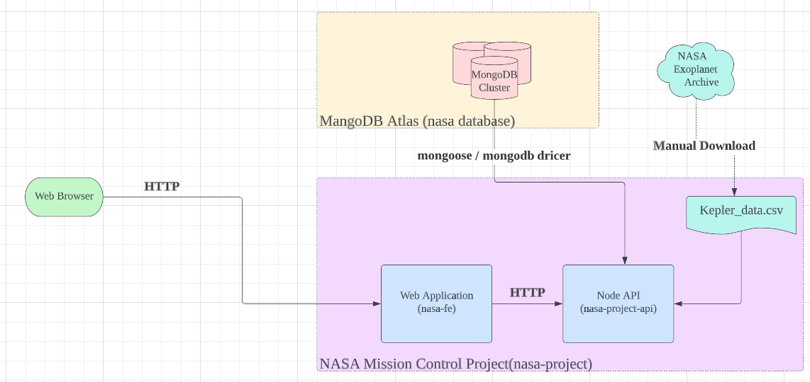

# 실습 목록

## [Planets](https://github.com/doitkim/TIL/tree/master/Node/Planets)

### 사용 언어

1. Node.js

### 사용 데이터

1. NASA 케플러 우주 망원경

### 사용 패키지

1. FS (파일 시스템)
2. CSV Parser

### 참고 자료

1. [CSV-PARSER](https://csv.js.org/parse/)
2. [CSV-PARSE-NPM](https://www.npmjs.com/package/csv-parse)
3. [FS](https://nodejs.org/api/fs.html)

## [NASA-Project](https://github.com/doitkim/TIL/tree/master/Node/NASA)

### Flow-Chart

### 사용언어

1. Node.js
2. React.js

### 사용 패키지

#### server

1. CORS
2. CSV-PARSE
3. EXPRESS
4. MORGAN
5. PM2
6. JEST
7. NODEMON
8. SUPERTEST
9. HTTP
10. OS
11. PATH

### 참고 자료

1. [Lucidchart](https://www.lucidchart.com/pages/)
2. [ARWES](https://github.com/arwes/arwes)
3. [CORS](https://www.npmjs.com/package/cors)
4. [Stream-Promise-api](https://nodejs.org/api/stream.html#stream_streams_promises_api)
5. [리액트배포](https://create-react-app.dev/docs/deployment/)
6. [morgan-logging](https://www.npmjs.com/package/morgan)
7. [Map](https://developer.mozilla.org/en-US/docs/Web/JavaScript/Reference/Global_Objects/Map)
8. [SeparationOfConcerns](https://en.wikipedia.org/wiki/Separation_of_conce)
9. [SeparationOfConcernsInSoftwareDesign](https://nalexn.github.io/separation-of-concerns/)
10. [LayerdArchitecture](https://www.vadimbulavin.com/layered-architecture-ios/)
11. [JEST](https://jestjs.io/)

## Performance

### 참고 자료

1. [CRYPTO](https://nodejs.org/api/crypto.html)
2. [속도와사용자관심도](https://www.speedcurve.com/blog/web-performance-monitoring-user-engagement/)
3. [응답 시간: 3가지 중요한 제한](https://www.nngroup.com/articles/response-times-3-important-limits/)
4. [클러스터모드](https://nodejs.org/api/cluster.html)
5. [로드밸런싱](<https://en.wikipedia.org/wiki/Load_balancing_(computing)>)
6. [수평적 확장과 수직적 확장](https://www.section.io/blog/scaling-horizontally-vs-vertically/)
7. [PM2](https://pm2.keymetrics.io/)
8. [PM2-NPM](https://www.npmjs.com/package/pm2)
9. [애플리케이션 배포 및 테스트 전략](https://cloud.google.com/architecture/application-deployment-and-testing-strategies?hl=ko)

## ThreadExample

### 참고 자료

10. [Worker Thread](https://nodejs.org/api/worker_threads.html)
11. [Web Wrokers API](https://developer.mozilla.org/en-US/docs/Web/API/Web_Workers_API)

## 데이터베이스

### 참고 자료

12. [JSON VS BSON](https://www.mongodb.com/json-and-bson)
13. [MONGODB TUTO](https://www.mongodb.com/docs/manual/tutorial/)
14. [POSTGRES JSON TYPE](https://www.postgresql.org/docs/current/datatype-json.html)
15. [객체관계형 임피던스 불일치](https://en.wikipedia.org/wiki/Object%E2%80%93relational_impedance_mismatch)
16. [ACID 트랜잭션](https://www.ibm.com/docs/en/cics-ts/5.4?topic=processing-acid-properties-transactions)
17. [몽고디비](https://www.mongodb.com/)
18. [최소권한의 원칙](https://www.cyberark.com/what-is/least-privilege/)
19. [몽구스](https://mongoosejs.com/)
20. [참조 무결성](https://en.wikipedia.org/wiki/Referential_integrity)
21. [NodeJS 모범사례 저장소](https://github.com/goldbergyoni/nodebestpractices)
22. [mysql-autoIncrement](https://dev.mysql.com/doc/refman/8.0/en/example-auto-increment.htm)
23. [postgresql series](https://www.postgresql.org/docs/current/datatype-numeric.html#DATATYPE-SERIAL)
24. [스페이스-X API](https://github.com/r-spacex/SpaceX-API)
25. [스페이스-X API JSON](./NASA//JSON/SpaceXAPIV4.postman_collection.json)
26. [Array.flatMap()](https://developer.mozilla.org/en-US/docs/Web/JavaScript/Reference/Global_Objects/Array/flatMap)
27. [DotENV](https://www.npmjs.com/package/dotenv)

## 보안

### 참고 자료

28. [https SSL 1](https://opentutorials.org/course/228/4894)
29. [https SSL 2](https://dc-choi.tistory.com/51)
30. [https SSL 3](https://slproweb.com/products/Win32OpenSSL.html)
31. [https SSL 4](https://slproweb.com/products/Win32OpenSSL.html)
32. [openssl git](https://github.com/openssl/openssl)
33. [helmet](https://helmetjs.github.io/)
34. [구글 소셜 로그인](https://cloud.google.com/identity-platform/docs/web/google?hl=ko)
35. [카카오 소셜 로그인](https://developers.kakao.com/docs/latest/ko/kakaologin/rest-api)
36. [네이버 소셜 로그인](https://developers.naver.com/docs/login/devguide/devguide.md)
37. [구글 맵스 API 최적화 가이드](https://developers.google.com/maps/api-security-best-practices?hl=ko)
38. [JWT](https://jwt.io/)
39. [OAuth](https://oauth.net/2/)
40. [passport](https://www.passportjs.org/concepts/authentication/middleware/)
41. [cookie](https://developer.mozilla.org/ko/docs/Web/API/Document/cookie)
42. [session](https://developer.mozilla.org/en-US/docs/Mozilla/Add-ons/WebExtensions/API/sessions)
43. [express-session npm](https://www.npmjs.com/package/express-session)
44. [express-session](https://expressjs.com/en/resources/middleware/session.html)
45. [OWASP NODEJS Cheet Sheet](https://cheatsheetseries.owasp.org/cheatsheets/Nodejs_Security_Cheat_Sheet.html)

## CI / CD

### 참고 자료

46. [github CI / CD](https://velog.io/@youngerjesus/Github-Action%EC%9D%84-%EC%9D%B4%EC%9A%A9%ED%95%9C-CICD-%EA%B0%9C%EB%B0%9C-%EC%A3%BC%EA%B8%B0-%EC%9E%90%EB%8F%99%ED%99%94)

## Docker

47. [docker build](https://docs.docker.com/engine/reference/commandline/build/)
48. [docker run](https://docs.docker.com/engine/reference/commandline/run/)
49. [docker aws](https://docs.aws.amazon.com/AmazonECS/latest/developerguide/create-container-image.html)

## GraphQL

### 참고자료

50. [공식홈페이지](https://graphql.org/)
51. [SWAPI GraphQL API](<https://graphql.github.io/swapi-graphql/?query=%23%20Welcome%20to%20GraphiQL%0A%23%0A%23%20GraphiQL%20is%20an%20in-browser%20tool%20for%20writing%2C%20validating%2C%20and%0A%23%20testing%20GraphQL%20queries.%0A%23%0A%23%20Type%20queries%20into%20this%20side%20of%20the%20screen%2C%20and%20you%20will%20see%20intelligent%0A%23%20typeaheads%20aware%20of%20the%20current%20GraphQL%20type%20schema%20and%20live%20syntax%20and%0A%23%20validation%20errors%20highlighted%20within%20the%20text.%0A%23%0A%23%20GraphQL%20queries%20typically%20start%20with%20a%20%22%7B%22%20character.%20Lines%20that%20start%0A%23%20with%20a%20%23%20are%20ignored.%0A%23%0A%23%20An%20example%20GraphQL%20query%20might%20look%20like%3A%0A%23%0A%23%20%20%20%20%20%7B%0A%23%20%20%20%20%20%20%20field(arg%3A%20%22value%22)%20%7B%0A%23%20%20%20%20%20%20%20%20%20subField%0A%23%20%20%20%20%20%20%20%7D%0A%23%20%20%20%20%20%7D%0A%23%0A%23%20Keyboard%20shortcuts%3A%0A%23%0A%23%20%20%20Prettify%20query%3A%20%20Shift-Ctrl-P%20(or%20press%20the%20prettify%20button)%0A%23%0A%23%20%20Merge%20fragments%3A%20%20Shift-Ctrl-M%20(or%20press%20the%20merge%20button)%0A%23%0A%23%20%20%20%20%20%20%20%20Run%20Query%3A%20%20Ctrl-Enter%20(or%20press%20the%20play%20button)%0A%23%0A%23%20%20%20%20Auto%20Complete%3A%20%20Ctrl-Space%20(or%20just%20start%20typing)%0A%23%0A%0A>)
52. [GraphQL Version](https://spec.graphql.org/)
53. [GraphQL Client](https://github.com/graphql/express-graphql)
54. [apollo](https://www.apollographql.com/)
55. [graphql-tool](https://the-guild.dev/graphql/tools)
56. [graphql-resolver](https://graphql.org/learn/execution/)
57. [graphql-id](https://spec.graphql.org/draft/#sec-ID)
58. [apollo](https://www.apollographql.com/docs/)
59. [apollo-server](https://github.com/apollographql/apollo-server)
60. [apollo-server Subscriptions](https://www.apollographql.com/docs/apollo-server/data/subscriptions/)

## Socket

### 참고자료

61. [Web Socket](https://developer.mozilla.org/en-US/docs/Web/API/WebSocket)
62. [ws](https://github.com/websockets/ws)
63. [socket.io](https://socket.io/)
64. [emit cheetsheet](https://socket.io/docs/v4/emit-cheatsheet/)
65. [CANVAS](https://developer.mozilla.org/en-US/docs/Web/API/Canvas_API/Tutorial/Drawing_shapes)
